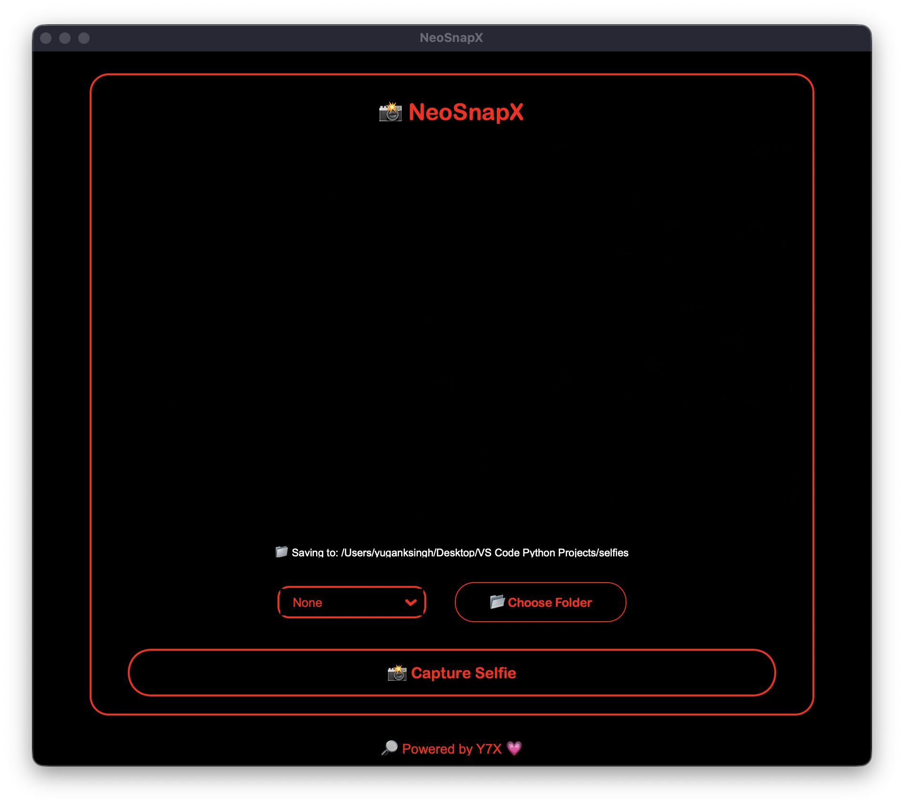

<h1 align="center">📸 NeoSnapX</h1>
<p align="center"><i>A glowing selfie capture experience — styled by Y7X 💗</i></p>

---

## 💎 What is NeoSnapX?

**NeoSnapX** is a real-time selfie app built with `customtkinter` and `OpenCV`, featuring:
- Face detection
- Countdown timer
- Filter effects
- AMOLED + Glow UI
- 💗 Y7X-style branding

---

## ⚙️ Features

- 📷 Live camera feed (mirrored)
- 🎨 Filters: None, Gray, Sketch
- 🧠 Face detection before saving
- ⏱️ 3-second countdown before capture
- 🖋️ Auto-watermark: `NeoSnapX by Y7X`
- 🖤 AMOLED UI with red outlines
- 🎀 Hover glow effect on buttons
- 📂 Folder selection to save selfies
- 🔐 Clean code, no external config needed

---

## 📸 Preview

<p align="center">
  
</p>

---

## 🛠️ Installation

Install the required libraries with:

```bash
pip install opencv-python pillow customtkinter